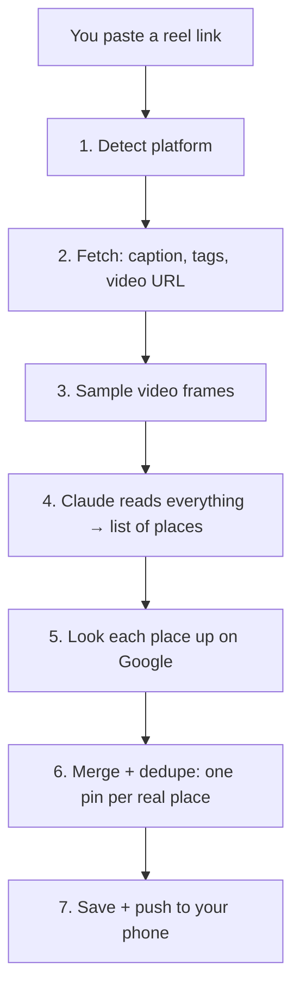

# ReelMap — Analysis Architecture (the plan we're adopting)

This is the design for the part of the app that turns a **reel link** into
**map pins with details**. It's written to be read by someone who knows only
the basics of computer science. No jargon without an explanation.

It takes the good ideas from the uploaded "AI Restaurant Reel Analyzer" spec,
throws out the parts that don't fit our app, and keeps what we already built
that works.

---

## 0. The whole thing in one breath

> You paste a reel → we grab the caption, tags, and video → an AI (Claude)
> reads all of it and lists every place the reel talks about → for each place we
> look it up on Google to get the *real* address, rating, hours, and photos →
> we save one clean pin per place and push it to your phone.

That's it. Everything below is just detail on each arrow.

---

## 1. The golden rule: three buckets of information

The single most important idea in the whole design. Every fact about a place
comes from one of **three sources**, and we **never mix them up**:

| Bucket | Where it comes from | Examples | Do we trust it as fact? |
|---|---|---|---|
| 🗣️ **Creator said it** | The reel itself (caption, voice, on-screen text) | "get the matcha croissant", "go before 10am", tips | It's an *opinion/claim*, not a verified fact |
| ✅ **Verified** | Google (a live business database) | address, GPS pin, rating, phone, hours, photos | Yes — this is ground truth |
| 🤖 **AI guessed it** | The AI looking at the video | "cozy", "good for a date", "looks like outdoor seating" | It's a *guess* — helpful, but labeled as such |

**Why this matters:** if we show a creator's "closes at 8pm" as if it were a
verified fact and the user shows up at 7:45 to a closed door, they stop trusting
the app. So we keep the buckets separate in the database and on screen. Verified
facts win; creator claims are shown as "from the reel"; guesses are shown as vibes.

This is the one big idea we're taking from the uploaded spec.

---

## 2. The pipeline, step by step

A "pipeline" just means a series of steps where each step's output feeds the
next. Here's ours. The file that does each step is noted in `code font`.



**Step 1 — Detect platform.** We look at the link and decide: Instagram,
TikTok, or YouTube. `worker/fetchers/base.py`

**Step 2 — Fetch the reel.** We use a service called **Apify** (think: a robot
that visits the page for us) to get the caption, hashtags, @mentions, the
creator's name, any tagged location, and a temporary link to the video.
*We never store the video itself* — we use it and throw it away.
`worker/fetchers/instagram.py`, `tiktok.py`, `youtube.py`

**Step 3 — Sample frames.** A reel is a video; the AI can't watch video, but it
*can* look at pictures. So we grab ~12 still images at the moments the scene
changes (that's usually where a new place + its on-screen name appears).
`worker/frames.py`

**Step 4 — Claude reads everything.** We hand the AI (Claude) *all* the signals
at once — caption, tags, transcript, and those frames — and it returns a
**structured list**: every place the reel recommends, each with a name, cuisine,
the creator's tips, what to order, and a vibe. This is the brain of the app.
`worker/extract.py`

**Step 5 — Look each place up on Google.** The AI gives us a *name* ("Devoción
in Williamsburg"); Google gives us the *truth* (exact GPS, address, rating,
hours, photos, phone). We call this "resolving" the place. `worker/geocode.py`

**Step 6 — Merge + dedupe.** "Dedupe" = remove duplicates. If three different
reels all mention the same café, we keep **one** pin for the café and attach all
three creators' tips to it. `worker/pipeline.py`

**Step 7 — Save + push.** We store the pins and send your phone a notification:
"3 places saved 📍". `worker/pipeline.py`, `worker/push.py`

---

## 3. Two decisions where we go against the uploaded spec (on purpose)

### 3a. We keep **Claude**, not Gemini

The spec recommends Google's **Gemini** because it can watch the *whole video*
natively, while Claude can only look at still frames.

That's a real advantage **for some reels** (a single restaurant, lots of talking,
tiny menu text). But **our reels are mostly *list* reels** — "9 best cafés in
Dallas" — where all the info is in the **caption's numbered list + the on-screen
text on the frames + the @tags**. Our frames-plus-Claude approach already nails
that, and it's cheaper (we don't upload a whole video every time).

- Claude has **no native video** (confirmed, July 2026) — frames + transcript is
  the standard workaround, and it fits list reels well.
- Switching to Gemini would mean rebuilding a working system for a benefit our
  main content doesn't need.

**Decision:** stay on Claude. But we'll wrap the AI step behind a small "adapter"
(a swappable slot) so we *could* A/B-test Gemini later on a sample of reels and
decide with data. No rebuild, just an option kept open.

### 3b. We keep **many places per reel**

The spec is built around **one restaurant per reel** (its final output is a
single `RestaurantRecord`). Our whole product — and the "auto-group into city
lists" feature — is about **list reels with many places**. Collapsing to one
place would break our core use case.

**Decision:** our list structure stays. We just make *each place in the list*
richer using the spec's good ideas.

---

## 4. The data we store (kept simple)

We already have the right shape. Three main "tables" (a table = a spreadsheet the
app stores data in):

- **`places`** — one row per *real-world* place, shared by everyone. This is the
  ✅ verified bucket: name, GPS, address, rating, hours, photos. If 100 users save
  the same café, there's still **one** row here.
- **`user_places`** — one row per *(user + reel + place)*. This is the 🗣️ creator
  bucket: your personal copy with the tips/what-to-order from the specific reel
  you saved.
- **`reel_sources`** — one row per reel we've analyzed (so we never re-analyze the
  same reel twice).

**Small additions** we'll make to `places` to hold more verified data from Google
(all in the ✅ bucket): `phone`, `review_count`, `business_status` (open /
permanently closed), `google_maps_url`, and `last_verified_at` (when we last
refreshed it). We do **not** need the spec's 7-table setup — that's built for a
much bigger company. Our 3 tables already do the job.

---

## 5. The accuracy playbook (what makes the results *good*)

These are the specific tricks — most are cheap prompt or logic tweaks — that take
the output from "okay" to "trustworthy."

1. **Completeness for list reels.** If the caption is a numbered list of 9 places,
   we *must* return 9. We already count the numbered items and tell the AI the
   expected number. (Already built.)

2. **"Shown" ≠ "recommended."** A dish appearing on screen isn't the same as the
   creator saying "you have to get this." We only mark something *must-try* when
   the creator actually praises it. (One-line prompt improvement.)

3. **Smart Google matching — never trust the first result.** This is the biggest
   accuracy upgrade. Right now we tend to take Google's first search hit, which
   can be the wrong branch or wrong city. Instead we **score** each candidate:

   | Signal | Weight |
   |---|---|
   | Name matches | 40% |
   | Right city/neighborhood | 25% |
   | Right category (café vs bar) | 15% |
   | Right branch (if a chain) | 10% |
   | Other clues agree (website, @tag) | 10% |

   Only accept a match if its score is high **and** clearly beats the runner-up.
   If nothing scores well, we save the place **without** a pin (still in your list)
   rather than pin it to the wrong spot. `worker/geocode.py`

4. **Conflict warnings.** If the creator says "open till 8" but Google says 7, we
   keep both and add a small warning, instead of silently overwriting one.

5. **Confidence + "needs a look."** The AI gives each place a confidence score
   (0–1). Low-confidence places are kept but flagged, never silently dropped and
   never presented as certain.

6. **Dedupe to one pin.** Same real place from many reels = one `places` row with
   everyone's tips attached. (Already built, via a shared place ID.)

---

## 6. The cost playbook (how we keep it cheap)

Every reel costs a little money (Apify + AI + Google). Here's how we keep it low:

1. **Cheap AI model by default.** Dev uses the small, cheap Claude tier (Haiku);
   we only reach for a stronger model when a reel is genuinely ambiguous.

2. **Google "field masks" — and the tier trap.** Google makes you list exactly
   which fields you want ("field mask"). **Critical gotcha:** Google bills your
   whole request at the price of its *most expensive* field. Asking for `rating`
   or `reviews` bumps the entire call into the pricey tier. So we split it:
   - a **cheap** first call to *find* the place (just ID + name + address + location), then
   - a **second** call for the pricier fields (rating, hours, photos) **only after**
     we've confirmed it's the right place.

   That way we never pay premium prices to look up a place that turns out wrong.

3. **Cache everything.** "Cache" = remember an answer so we don't pay to compute
   it twice.
   - Already-analyzed reel → reuse the result (don't call the AI again).
   - Already-looked-up place → reuse Google's answer for a while.
   - We refresh volatile facts (hours, rating) every few days, but stable facts
     (address) rarely.

4. **Dedupe.** One Google lookup per real place, not per reel that mentions it.

5. **Log the cost per reel** so we can watch it. (Already built — see the
   `[metrics]` line in the worker logs.)

---

## 7. What we take / add / skip (vs the uploaded spec)

| From the spec | Verdict | Why |
|---|---|---|
| 3 buckets: creator / verified / AI-guess | ✅ **Take** | The core trust principle |
| Google Places with candidate **scoring** | ✅ **Take** | Biggest accuracy win; fixes "wrong pin" |
| "Shown ≠ recommended" prompt rule | ✅ **Take** | Cheap, real quality gain |
| Conflict warnings | ✅ **Take** | Builds trust |
| Field masks + two-step Google calls | ✅ **Take** | Directly controls cost |
| Cache by reel + place | ✅ **Take** (mostly built) | Cheap + fast |
| **Gemini** as the main model | ❌ **Skip** | Our list reels don't need native video; keep Claude |
| **One restaurant per reel** schema | ❌ **Skip** | We're multi-place by design |
| Evidence **timestamps** on every field | 🕒 **Later** | Nice, but adds cost/complexity now |
| **200-video** labeled eval set | 🕒 **Later** | Start with a 10–20 reel "golden set" |
| Official-Instagram website-scraping verify | 🕒 **Later** | Low payoff for the effort right now |
| 7-table normalized DB + manual-review UI | 🕒 **Later** | Big-company machinery; our 3 tables suffice |

---

## 8. Build order (what we do, in order)

1. **Verify (you).** Run the harness (`python -m worker.cli <url> --raw
   --save-frames ./frames --geocode --json-out out.json`) on ~10 real reels
   across all 3 platforms. Note what's missing or wrong. *(Tool is already built.)*

2. **Refine extraction (me).** From your notes: tune the prompt/schema —
   shown-vs-recommended, cuisine taxonomy, conflict warnings — and add a tiny
   golden-set test so it never regresses.

3. **Fix the pins (me).** Turn on Google Places with the **candidate scoring** and
   **two-step field masks** above. This fills ratings, photos, hours, phone —
   the biggest visible jump toward "production ready." *(You'll get a Google key;
   I'll add a spend cap.)*

4. **Lock the display (together).** Map the final fields to each screen (pin →
   detail → list), using the three buckets so verified/creator/guess look
   different on screen.

5. **Production hardening (me).** Retries + timeouts on Apify, per-user limits,
   host the backend off your Mac (so it runs 24/7), then TestFlight.

---

## 9. Settings you'll add later (in `backend/.env`)

```env
# Turn on real pins (ratings, photos, hours) — Step 3 above
GEOCODER=google
GOOGLE_PLACES_API_KEY=...        # you'll create this key

# Accuracy thresholds for Google matching (Step 5.3)
PLACE_AUTO_ACCEPT_THRESHOLD=0.85 # accept a match only above this score
PLACE_MIN_MARGIN_OVER_SECOND=0.15 # ...and only if it clearly beats runner-up
```

Everything else (Anthropic key, Apify token, model tier) is already wired up.

---

## 10. The one-sentence summary

**Claude reads the whole reel and lists every place; Google verifies each one
with careful scoring; we keep creator-claims, verified-facts, and AI-guesses in
separate buckets so the app is fast, cheap, and honest.**
